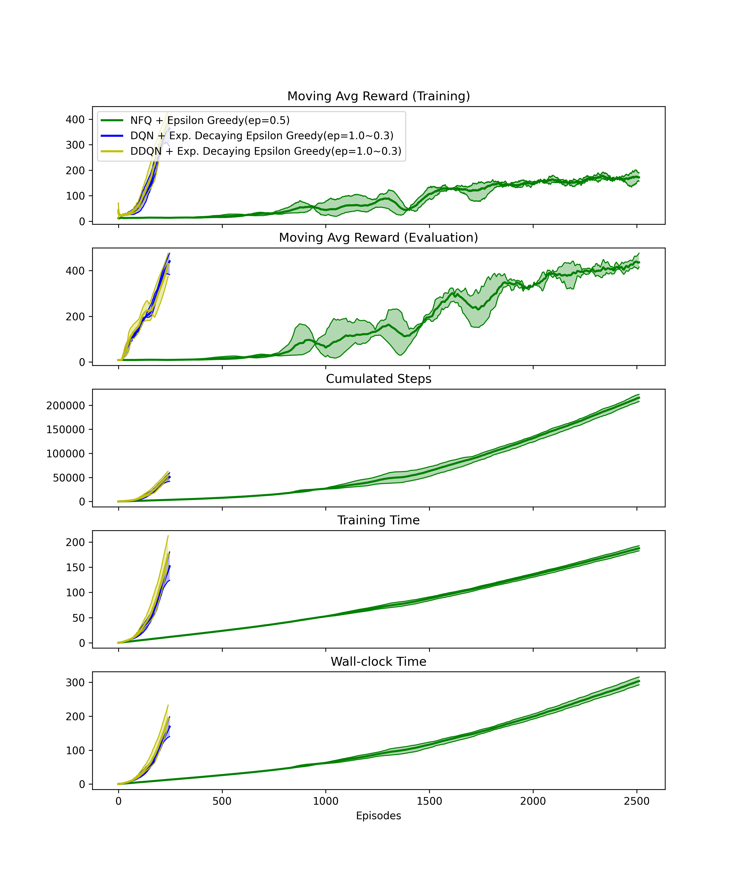
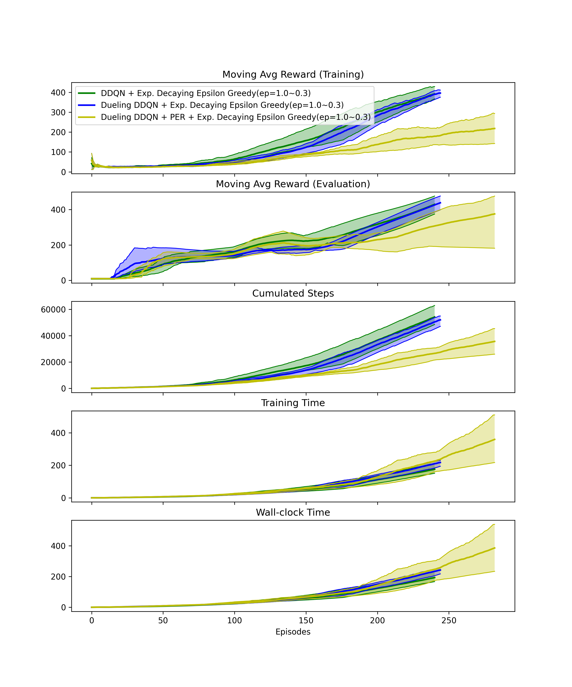

# Deep Reinforcement Learning Examples

## Experiment results

* NFQ vs DQN  vs Double DQN for CartPole-v1

* DDQN vs Dueling DDQN vs Dueling DDQN + PER for CartPole-v1

## References

* Grokking Deep Reinforcement Learning
  * Book: https://www.manning.com/books/grokking-deep-reinforcement-learning
  * Github: https://github.com/mimoralea/gdrl
* Gymnasium
  * Docs: https://gymnasium.farama.org/index.html